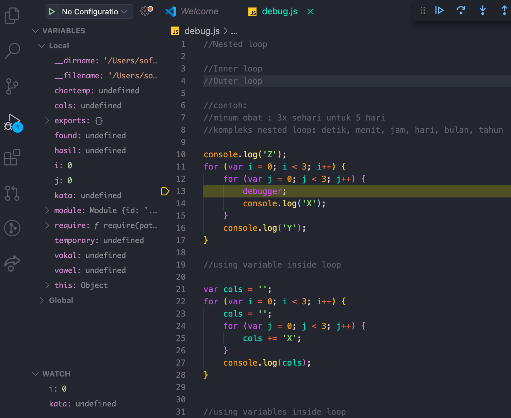

## Note Debugging

Debugging dengan terminal itu untuk membantu tracing semantic logic error. Dia tidak untuk mendeteksi syntax dan runtime error. Karena syntax dan runtime error otomatis akan ditangkap oleh node.

 **Selalu lihat di Dokumentasi**

- https://nodejs.org/api/debugger.html

Menjalankan debugger node.js:
 `node inspect <namafile>.js`

 

Di inspector node.js terdapat `watcher` (pengamat expression)

### `debugger;`

- Tulis di kode debugger; sebagai breakpoint (seperti break;) agar watcher inspeksi berhenti dibaris tersebut untuk melihat perubahan nilai terakhir yang di dapat oleh variabel yang diamati. Ketika watcher tidak menemukan breakpoint, maka otomatis watcher akan mengambil line 1.

 

### n atau next

- Agar menuju ke stamement berikutnya (Step Next) yang bisa di baca oleh watcher. Jika ada statement seperti variabel / object / invoke function (blok function tidak di watch, kecuali jika sudah step-in) maka jika tidak ada watcher maka akan ke loader.js

 ### c atau cont

- Untuk menuju ke debugger, jika ada debugger lagi maka akan menuju debugger berikutnya. Jika tidak ada debugger maka tidak menjalankan apa-apa kecuali invoke. Maka akan memunculkan pada step debugger tersebut perubahan nilai akan terlihat.

 

### .exit

- Untuk keluar dari mode debugger dan watcher dihapus

 

### r atau restart

- Untuk kembali menjalankan debugger tanpa menghapus watcher

 

### watch('expression')

- Untuk menambahkan watcher. Masukkan statement seperti inisialiasi variabel, invoke function, object, pemanggilan variabel, assingment nilai ke variabel, dsb.

 

### watchers

- Untuk mendapatkan list semua watchers dan nilai saat itu dan mendapat index watchers

 

### watchers[index]

- Untuk dapatkan nilai watcher saat itu, hanya salah satu lalu untuk keluar di CTRL+C

 

### unwatch('expression')

- Untuk menghapus sebuah watcher untuk expression tertentu sehingga tidak lagi diperiksa atau ditracing

 

### repl

- Untuk melakukan standalone testing terhadap expression (variabel) yang tidak di watcher / eksperimen terhadap nilai saat itu tersebut dengan nilai nilai lain dalam sebuah expression. Untuk keluar dari repl CTRL + C

 

### s atau step

- (Step-in) untuk melakukan pemeriksaan watcher ke dalam scope function walaupun belum diinvoke. Jadi secara terus menerus memeriksa proses di function sebagai unit testing sampai masing masing function sudah sesuai logic nya dan step masuk ke dalam loop

 

 ### o atau out

- (Step-out) untuk keluar dari watch yang memeriksa ke dalam function untuk keluar dari blok function untuk meriksa blok global dan bisa step-in lagi untuk memeriksa function lain.

 

### exec('expression')

- Untuk menampilkan output expression yang tidak di watch dengan nilai saat itu. Berbeda dengan repl karena kita tidak bisa masuk ke mode experiment. Hanya untuk output.

 

### sb() atau setBreakpoint()

- Untuk membuat breakpoint pada baris yang sedang diperiksa tanpa menulis debugger; di script kita. 

 

### sb(line) atau setBreakpoint(line)

- Untuk membuat breakpoint pada baris tertentu tanpa menulis debugger; di script kita. 

 

### sb('namafunction()') atau setBreakpoint('namafunction()')

- Untuk membuat breakpoint pada statement pertama di function tersebut tanpa menulis debugger; di script kita. 

 ### sb('namafile.js', 123) atau setBreakpoint('namafile.js', 123)

- Untuk membuat breakpoint pada script.js di baris tertentu tanpa menulis debugger; di script kita. Perintah ini ketika cont maka debugger keluar dari file saat ini dan menuju ke file tersebut

 

### list(10)

- Untuk menampilkan preview 10 baris sesudah dan sebelum breakpoint dari script yang di debug

 

### kill

- Untuk mengakhiri debugger dan watcher sehingga keluar dari sesi debugging

 

------

 

## Debugging dengan VSCode

1. Klik breakpoint pada baris tertentu di VSCode atau ketikkan debugger di kode sesuai bagian yang diperiksa (biasanya diletakkan di condition atau loop)
2. Buka sebuah file javascript di VSCode atau F5
3. Klik tab `Run and Debug` 
4. Pilih `Environment` - `Node.js`

5. Di bagian Tab `variables` terdapat list expression yang bisa diperiksa

6. Masukkan variabel atau expression yang diperiksa watcher di Tab `Watch`

7. Klik tombol next / step-in / step-out untuk step memeriksa expression yang selalu berhenti di code `debugger`

